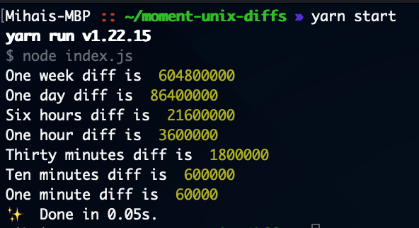

# Moment unix diffs

A simple script printing our a series of date differences using Moment.js

## How to run
* `git clone git@github.com:miutamihai/moment-unix-diffs.git`
* `cd moment-unix-diffs`
* `yarn install`
* `yarn start`

The results will be printed to the console.

## Example run

